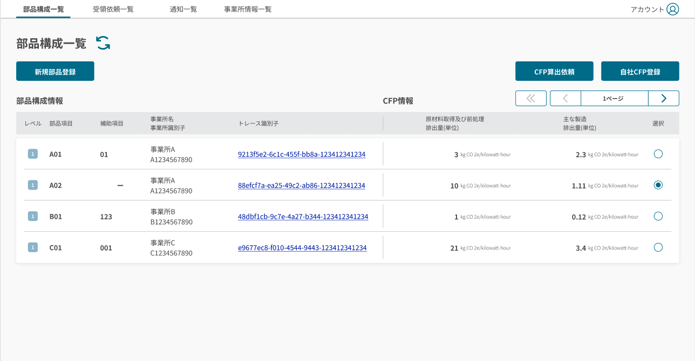
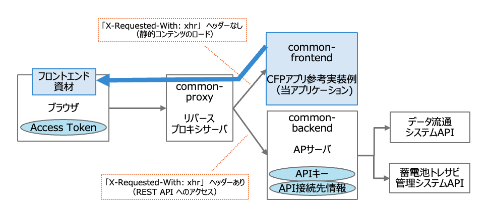
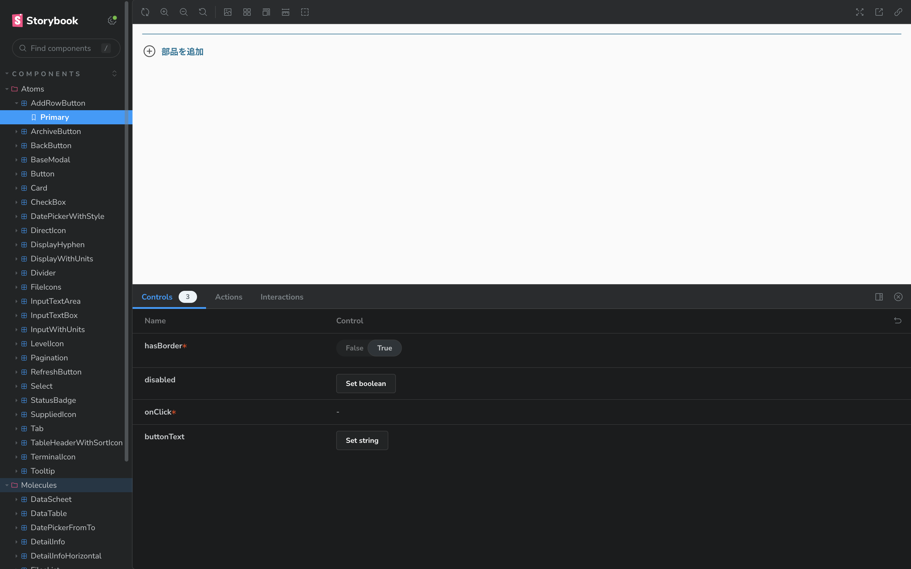

# CFP アプリ参考実装例

当リポジトリは、蓄電池トレーサビリティ管理システム・データ流通システム[^1]を利用するためのフロントエンドアプリケーションの実装例を、OSSとして公開したものである。

[^1]: 自動車電池用部品のカーボンフットプリント (Carbon Footprint of Products: CFP) をサプライヤーから収集しOEMにて集計するシステム

## 背景と目的

電動車向け蓄電池は多様な部品で構成されており、欧州電池規制の要件に従ってCFPを当局に報告するためには、サプライヤーおよび納品先各社が自社部品にかかるCFPを登録し、CFPを算出する仕組みが必要である。

当アプリケーションは、部品構成登録、CFP回答依頼、CFP登録、証明書登録、CFP算出と参照機能を通じ、秘匿性の高い企業間のデータ共有を可能にする。

| 実行画面例                                           |
| :--------------------------------------------------- |
|  |

### アプリケーション構成

当アプリケーションは、Web UI (sample-application-cfp-frontend, 以下 cfp-frontend) およびリバースプロキシサーバ (sample-application-cfp-proxy, 以下 cfp-proxy) APサーバ (sample-application-cfp-backend, 以下 cfp-backend) の併用が前提となる。
本リポジトリでは cfp-frontend を説明対象とし、cfp-proxy と cfp-backend は別のリポジトリで提供する。



- CFP アプリ参考実装例 (cfp-frontend): 当アプリケーション

  - 蓄電池トレーサビリティ管理システムの CFP アプリ参考実装例である。
  - データ流通システム API および蓄電池トレーサビリティ管理システム API を利用してデータの参照や登録を行う。
  - ブラウザは、当アプリケーションからフロントエンド資材をロードする。
  - 当アプリケーションからこれらの API へアクセスを行う際には、`X-Requested-With: xhr` ヘッダーが付与される。
  - リバースプロキシサーバ (cfp-proxy) により `X-Requested-With: xhr` ヘッダーの有無で転送先を振り分ける。
  - API のエンドポイントと API キーの情報は、cfp-backend アプリケーションが保持するため、当アプリケーション内での設定は行わない。

- リバースプロキシサーバ (cfp-proxy)

  - ブラウザからのアクセス先となるリバースプロキシサーバである。
  - cfp-frontend アプリケーションにて API アクセス時に付与される `X-Requested-With: xhr` ヘッダーの有無に応じて、振り分け転送を行う。
    - `X-Requested-With: xhr` ヘッダーが付与されていない場合: CFP アプリ参考実装例 (cfp-frontend) へ転送する。
    - `X-Requested-With: xhr` ヘッダーが付与されている場合: AP サーバ (cfp-backend) へ転送する。

- AP サーバ (cfp-backend)

  - データ流通システム API と 蓄電池トレーサビリティ管理システム API へのアクセスを制御する AP サーバである。
  - API のエンドポイントと API キーの情報を保持する。
  - ブラウザからの API リクエストを処理する。

## 前提とする環境

### アプリケーション実行環境

| ツール | バージョン |
| ------ | --------- |
| node   | 20.11.0   |
| npm    | >= 10.2.4 |

## 起動手順

### リポジトリのクローン

当リポジトリのクローンを行う。

```sh
# 当リポジトリのクローン
git clone https://github.com/ouranos-ecosystem-idi/sample-application-cfp-frontend.git cfp-frontend
cd cfp-frontend
```

### ローカル環境での起動

```sh
# パッケージのインストール
npm ci

# ローカル環境でのアプリケーションの起動
npm run dev
```

http://localhost:3000/ でアプリケーションが起動する。
Web サーバーを用いてアプリケーションを実行する場合は、後続のビルド手順及びビルド後の実行を実施する。

## ビルド手順

### アプリケーションのビルド

当アプリケーションが cfp-backend アプリケーションと正しく連携するには、
cfp-backend のURL情報をファイル .env.local に指定する必要がある。
任意のエディタで .env.local を編集し、変数 `NEXT_PUBLIC_DATA_TRANSPORT_API_BASE_URL` の値に
cfp-backend が公開しているURLのベース部分 (後半のパスを除いたもの) を指定する。
このとき、URL中のFQDNもしくはIPアドレスは、ユーザのブラウザから到達可能である必要がある。
記述例を以下に示す。

```
$ cat .env.local
NEXT_PUBLIC_DATA_TRANSPORT_API_BASE_URL=http://localhost
```

上記ファイルを編集したら、以下のコマンドでアプリケーションをビルドする。

```sh
# アプリケーションのビルド
npm run build
```

## ビルド後の実行

ビルドされたアプリケーションは `out` ディレクトリ配下に作成される。これを任意の Web サーバーに配置し、Web ブラウザからアクセスすることで実行する。

```sh
# ビルドされたアプリケーションをWebサーバーのDocument rootディレクトリに配置
cp -r out/. <web_server_document_root_directory>
```

nginx を利用する場合に include 可能な設定サンプルは、`server.conf` に配置されている。

## テスト手順

### 単体テスト(Jest)の実行

```sh
npm run test:unit

# (win) レポートを開く
start tests/unit/report.html

# (mac) レポートを開く
open tests/unit/report.html
```

## UI コンポーネントカタログの参照

UI コンポーネントカタログの Storybook が参照可能である。

```sh
npm run storybook
```

http://localhost:6006/ で Storybook が起動する。


## API 仕様書の更新

当アプリケーションは、以下の 2 つの API を利用する。

- データ流通システム API
- 蓄電池トレーサビリティ管理システム API

これらの API について OpenAPI 仕様書を取り込んだ上で API クライアントを生成する。
各 API が更新された際には、更新された仕様書で API クライアントを再生成する必要がある。

### OpenAPI 仕様書の配置

更新された OpenAPI 仕様書を以下のディレクトリに配置する。

- データ流通システム API の仕様書は `api/schemas/openapi.yaml` に配置する
- 蓄電池トレーサビリティ管理システム API の仕様書は `api/schemas/tr_openapi_b.yaml` に配置する。

### ts ファイルの生成

以下のコマンドで ts ファイルを生成する。

```sh
# データ流通システムAPI
npx openapi-typescript api/schemas/openapi.yaml --output api/schemas/dataTransport.ts

# 蓄電池トレーサビリティ管理システムAPI
npx openapi-typescript api/schemas/tr_openapi_b.yaml --output api/schemas/traceability.ts
```

## コーディング規約

[SonarQube の 2024年時点の LTS 版 v9.9.2](https://www.sonarsource.com/products/sonarqube/downloads/lts/9-9-lts/) の Sonar way ルールを適用している。

## 問合せ及び要望に関して

- 本リポジトリは現状は主に配布目的の運用となるため、IssueやPull Requestに関しては受け付けておりません。

## ライセンス

- 本リポジトリはMITライセンスで提供されています。
- ソースコードおよび関連ドキュメントの著作権は株式会社NTTデータグループに帰属します。

## 免責事項

- 本リポジトリの内容は予告なく変更・削除する可能性があります。
- 本リポジトリの利用により生じた損失及び損害等について、いかなる責任も負わないものとします。
